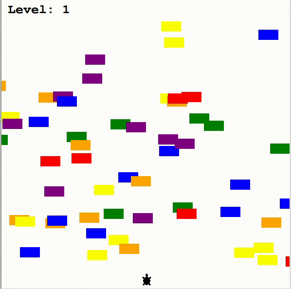

# turtle-crossing-game

This Turtle Crossing Game is part of the 100 Days of Code - The Complete Python Pro Bootcamp. (Day 23) 

Similar to crossing road game, we have a whole bunch of cars, going across a super busy multilane highway, and our turtle is the player who have to cross the road. 

## GUI Demo

## Instructions
Use the arrow up key to move the turtle to the other side of the street without getting hit by a car. Be careful as the cars will be moving faster, each time you level up.
